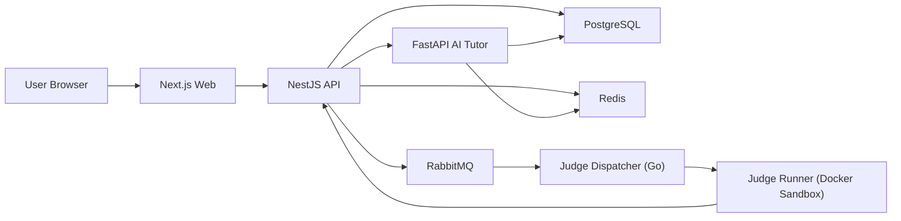

# LeetCodePro 技术设计文档（TECH_DESIGN）

## 1. 设计目标与范围

本设计聚焦 V1.0（MVP）主流程：`做题 -> 提交判题 -> AI 诊断/点评`，并为 V2.0 的个性化推荐与能力画像预留扩展位。

约束目标：
- 判题反馈尽量控制在 2 秒内（含队列与执行）。
- AI 首字响应尽量控制在 1.5 秒内（流式返回）。
- 支持核心代码模式与 ACM 模式双模式统一判题。
- 业务服务、判题服务、AI 服务解耦，支持独立扩容。

---

## 2. 技术栈选择

### 2.1 前端（Web）

- 框架：`Next.js (React + TypeScript, App Router)`
- UI：`Tailwind CSS + shadcn/ui`
- 编辑器：`Monaco Editor`
- 状态与请求：`Zustand + TanStack Query`
- 实时流：`SSE`（AI 对话流式输出、判题状态轮询/推送）

选择理由：
- Next.js 适合快速搭建复杂交互页面与中后台型产品，工程化成熟。
- Monaco 能较低成本提供接近 VS Code 的编辑体验（高亮、补全、折叠、括号匹配）。
- TanStack Query 可标准化缓存、重试、请求状态，减少重复网络逻辑。

### 2.2 后端（业务 API）

- 主语言/框架：`Node.js + NestJS + TypeScript`
- API 协议：`REST`（MVP），内部服务可逐步演进为 `gRPC`
- 鉴权：`JWT (Access + Refresh)`，密码 `Argon2`
- 缓存与限流：`Redis`

选择理由：
- NestJS 模块化和依赖注入清晰，适合多人协作和中长期维护。
- 与前端 TS 技术栈一致，降低跨端沟通与 DTO 重复成本。

### 2.3 判题系统（Judge）

- 调度服务：`Go`（高并发、低资源占用）
- 隔离执行：`Docker + seccomp + cgroups + 非 root 用户`
- 队列：`RabbitMQ`（提交削峰、异步执行）
- 结果存储：写回业务 API / DB（幂等更新）

选择理由：
- 判题是高并发、CPU 密集场景，Go 作为调度层更稳健。
- Docker + seccomp/cgroups 能覆盖资源限制与系统调用白名单需求。

### 2.4 AI 导师服务

- 服务框架：`Python + FastAPI`
- 模型接入：统一 `LLM Gateway`（可接 DeepSeek/Claude/OpenAI 兼容接口）
- 检索增强：`PostgreSQL + pgvector`（MVP 可先存规则知识与题解摘要）
- 输出协议：`SSE` 流式返回

选择理由：
- Python 生态适合快速迭代提示词、评测链路和 RAG 能力。
- AI 服务单独拆分，便于独立部署和成本控制。

### 2.5 数据与基础设施

- 主数据库：`PostgreSQL`
- 缓存/会话/限流：`Redis`
- 对象存储：`S3 兼容存储（MinIO/云对象存储）`（用于题面资源、日志归档）
- 可观测性：`OpenTelemetry + Prometheus + Grafana + Loki`
- 部署：`Docker Compose（开发）`，`Kubernetes（生产）`

---

## 3. 总体架构（大致）



核心流程：
1. 用户提交代码到 API，API 记录 `submission`（状态 `QUEUED`）并投递队列。
2. Judge Dispatcher 消费任务，拉起隔离容器执行编译/运行/对拍。
3. 判题结果回写 DB，前端轮询或订阅状态更新。
4. 用户点击 AI 诊断，API 聚合题目、代码、错误信息后调用 AI 服务，SSE 流式返回。

---

## 4. 项目结构（代码组织）

建议使用 Monorepo（`pnpm workspace`）：

```text
LeetcodePro/
  apps/
    web/                    # Next.js 前端
    api/                    # NestJS 业务 API
  services/
    ai-tutor/               # FastAPI AI 服务
    judge-dispatcher/       # Go 判题调度服务
  workers/
    judge-runner/           # 判题执行镜像与运行器脚本
  packages/
    shared-types/           # 前后端共享 DTO/类型
    eslint-config/
    tsconfig/
  infra/
    docker-compose/
    k8s/
    observability/
  scripts/
    seed/                   # 题库导入、初始化脚本
  docs/
    PRD.md
    TECH_DESIGN.md
```

后端模块建议（NestJS）：
- `auth`：注册、登录、令牌刷新、权限。
- `problems`：题目、标签、题面、多语言模板代码。
- `submissions`：提交记录、状态机、结果查询。
- `judge`：投递任务、回调鉴权、重判。
- `ai`：会话编排、提示词模板、审计日志。
- `recommendation`（V2）：每日推题、短板画像。

---

## 5. 数据模型（需要存储的数据）

以下为核心表（MVP + V2 预留）：

### 5.1 用户与权限

- `users`
  - `id` (PK)
  - `email` (unique)
  - `password_hash`
  - `nickname`
  - `created_at`, `updated_at`

- `user_settings`
  - `user_id` (PK/FK)
  - `theme`（dark/light）
  - `preferred_languages`（如 cpp/python）
  - `daily_goal`

### 5.2 题库与测试数据

- `problems`
  - `id` (PK)
  - `slug` (unique)
  - `title`
  - `difficulty`
  - `description_md`
  - `input_spec`, `output_spec`
  - `mode_support`（`CORE|ACM|BOTH`）

- `problem_tags`
  - `problem_id` (FK)
  - `tag`（array/hash/dp/...）

- `problem_templates`
  - `problem_id` (FK)
  - `language`（cpp/python/...）
  - `core_template`
  - `acm_template`

- `test_cases`
  - `id` (PK)
  - `problem_id` (FK)
  - `input_data`
  - `expected_output`
  - `is_hidden`
  - `weight`

### 5.3 判题与提交

- `submissions`
  - `id` (PK)
  - `user_id` (FK)
  - `problem_id` (FK)
  - `language`
  - `mode`（CORE/ACM）
  - `code`
  - `status`（QUEUED/RUNNING/AC/WA/TLE/RE/CE）
  - `runtime_ms`, `memory_kb`
  - `passed_count`, `total_count`
  - `error_message`
  - `created_at`

- `submission_case_results`
  - `submission_id` (FK)
  - `case_id` (FK)
  - `status`
  - `runtime_ms`, `memory_kb`
  - `stderr`

### 5.4 AI 导师与推荐

- `ai_sessions`
  - `id` (PK)
  - `user_id` (FK)
  - `problem_id` (nullable FK)
  - `context_submission_id` (nullable FK)
  - `session_type`（hint/debug/review）

- `ai_messages`
  - `id` (PK)
  - `session_id` (FK)
  - `role`（user/assistant/system）
  - `content`
  - `token_usage`
  - `created_at`

- `user_problem_stats`
  - `user_id` (FK)
  - `problem_id` (FK)
  - `attempt_count`
  - `best_status`
  - `last_result`
  - `last_practiced_at`

- `user_skill_profile`（V2）
  - `user_id` (FK)
  - `topic`（dp/graph/...）
  - `score`
  - `weakness_level`
  - `updated_at`

---

## 6. 关键技术点（难点与注意事项）

### 6.1 双模式判题统一

- 难点：核心代码模式与 ACM 模式编译/运行入口不同。
- 方案：统一中间表示（`JudgeJob`），按 `mode + language` 选择模板包装器，输出统一结果结构。

### 6.2 沙箱安全与资源控制

- 难点：恶意代码（死循环、fork 炸弹、文件探测、网络访问）。
- 方案：
  - 容器禁网、只读根文件系统、非 root 用户。
  - cgroups 限制 CPU/内存/进程数。
  - seccomp 系统调用白名单。
  - 编译与执行超时硬中断（kill + 回收）。

### 6.3 判题高并发与稳定性

- 难点：笔试高峰提交洪峰导致排队积压。
- 方案：
  - RabbitMQ 削峰，按语言/题型设置 worker 池。
  - Submission 状态机幂等更新，避免重复消费造成脏数据。
  - 热题测试数据缓存与编译缓存（同语言/同模板场景）。

### 6.4 AI 反馈质量与延迟

- 难点：既要快又要“启发式”，避免直接给答案。
- 方案：
  - 提示词策略分层：`hint`、`debug`、`review` 三类模板。
  - 基于 submission 错误上下文（失败样例、stderr、代码片段）构建输入。
  - SSE 流式输出，先返回诊断方向，再补细节。

### 6.5 Prompt 注入与数据安全

- 难点：用户可能在代码/对话中注入越权指令。
- 方案：
  - 系统提示与用户内容强隔离，严格 role 边界。
  - 上下文白名单字段拼装，禁止拼接内部敏感配置。
  - 记录 AI 请求审计日志并做敏感词/策略拦截。

### 6.6 可观测性与故障排查

- 难点：链路跨前端/API/队列/Judge/AI，问题定位复杂。
- 方案：
  - 全链路 TraceID。
  - 指标：提交耗时、队列积压、判题成功率、AI TTFB、模型错误率。
  - 日志结构化，分级告警（P95 延迟、错误率阈值）。

---

## 7. 里程碑建议（与 PRD 对齐）

### V1.0（MVP）
- 完成题库导入、双模式编辑与提交判题。
- 完成 AI 诊断按钮（基于提交结果的单轮/短多轮分析）。
- 完成基础用户系统与进度统计。

### V2.0
- 上线每日个性化推题（基于 `user_problem_stats + user_skill_profile`）。
- 首页加入能力雷达图与打卡热力图。
- AI 导师升级为多轮上下文引导。

### V3.0
- 引入用户自定义知识库（RAG 上传/索引）。
- 增加模拟面试、排行榜与好友 PK。

---

## 8. 非目标（MVP 暂不做）

- 不做多租户企业管理后台。
- 不做复杂社交系统（关注、动态流）。
- 不做自研大模型训练，仅做模型编排与推理接入。

